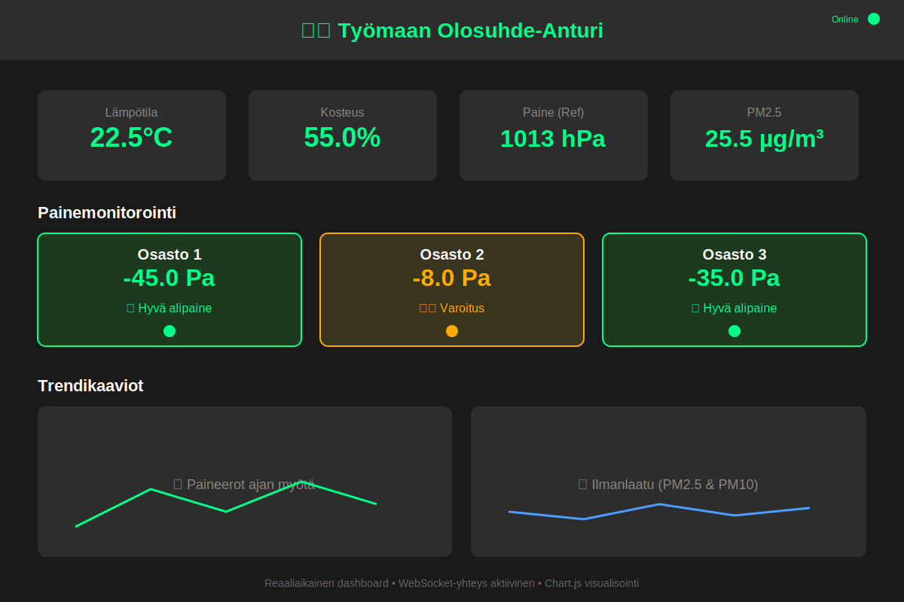
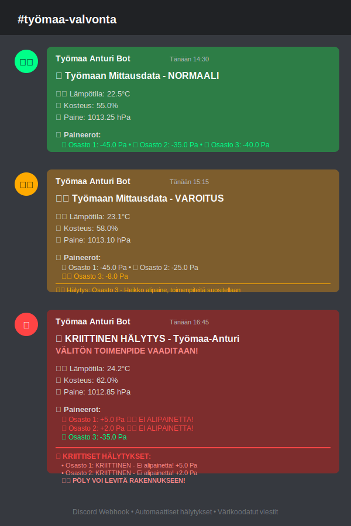

# 🏗️ Rakennustyömaan alipaine- ja ilmanlaadunvalvontajärjestelmä
Idea oli yrittää tekoälyä hyödyntämällä rakentaa laaja rakennustyömaan olosuhde anturi ja säädin. Tarkoitus oli rakentaa laite joka raportoisi sisäilman avain luvut ja säätäisi alipaineistajien toimintaa niin että eri osastojen väliset raja-arvot pysyisivät koko ajan viite kehyksessä.
Laitteisto helpottaisi asennustyötä ja raportointia esimerkiksi tyypillisessä sisä-ilmasaneerauksessa. Kun alipainetta säädettäisiin keskitetysti saataisiin alipaine pysymään kohtuullisena joka helpottaa sekä alipaineistuksen toteuttamista myös esimerkiksi rakennustiivistyksien toteutusta.
Liian korkea alipaine tai liian matala alipaine aiheuttavat molemmat ongelmia. Todellisuudessa ongelmaksi muodostuu alipaineistajien huonot säätö-ominaisuudet. Niissä ei usein ole minkään näköistä säätöä. Eli tarvittaisiin esimerkiksi erillisit taajuusmuuntajat joita voitaisiin ohjata.
Hyvä raportointi ominaisuus helpottaisi työnjohtajien työtä. Ja todennettu sisäilman kvartsi pitoituus vähentäisi työntekijöiden tarvetta käyttää suojaimia nostaen sitä kautta työntuottavuutta ja yleistä mukavuutta.
Tiedän ettei palautus varsinaisesti vastaa kurssin tehtävän antoa mutta eksyin hiukan sivuraiteille. Jatkan projektin kehittämistä omatoimisesti.

Järjestelmä valvoo alipaineistettuja tiloja rakennustyömaalla, seuraa puhtaantilan ilmanlaatua ja varmistaa alipaineistuksen jatkuvan toiminnan. Se tallentaa mittausdatan raportointia varten työsuojeluviranomaisille, tilaajille ja tilan käyttäjille.

---

## ⚖️ Tausta ja lainsäädäntö

Rakennustyömaiden pölynhallintaa ohjaavat kansalliset ja EU-tason määräykset. Tämä järjestelmä tukee näiden velvoitteiden täyttämistä automaattisella seurannalla ja dokumentoinnilla.

**Keskeisiä säädöksiä ja ohjeita:**

- [Työturvallisuuslaki (738/2002)](https://www.finlex.fi/fi/laki/ajantasa/2002/20020738) – työnantajan vastuu työntekijöiden turvallisuudesta  
- [Valtioneuvoston asetus rakennustyön turvallisuudesta (205/2009)](https://www.finlex.fi/fi/laki/ajantasa/2009/20090205) – pölyn leviämisen estäminen ja vaarallisten aineiden hallinta  
- [Työturvallisuuskeskus: Pölyntorjunta ja -hallinta rakennusalalla](https://ttk.fi/) – alipaineistuksen käytön ja seurannan ohjeistus  
- [EU-direktiivi 89/391/ETY](https://eur-lex.europa.eu/legal-content/FI/TXT/?uri=CELEX%3A31989L0391) – työnantajan velvollisuus ehkäistä työpaikan riskejä, kuten pölyaltistumista

---

## 🎯 Projektin Tarkoitus

- 🌡️ **Valvoa puhtaantilan ilmanlaatua ja olosuhteita** – lämpötila, kosteus, pienhiukkaset (PM2.5 & PM10)
- 📊 **Varmistaa alipaineistuksen jatkuva toimivuus** – vertaa osastojen painetta puhtaan puolen referenssiin
- 💾 **Tallentaa mittausdatan automaattisesti** – SQLite-tietokanta raportointia varten
- 📋 **Tarjota raportointimateriaalia** – viranomaisille, tilaajalle ja muille sidosryhmille
- 🚨 **Hälyttää poikkeamista reaaliaikaisesti** – Discord-ilmoitukset ja visuaaliset hälytykset
- 📈 **Visualisoi trendit** – Reaaliaikainen web dashboard Chart.js-kaavioilla

---

## 📚 Lähteet ja Työkalut

Projektin toteutuksessa on hyödynnetty seuraavia lähteitä ja työkaluja:

**AI-avustajat:**
- [Claude](https://claude.ai/) - Koodin kehitys ja arkkitehtuuri
- [ChatGPT](https://chat.openai.com/) - Ongelmanratkaisu ja dokumentaatio

**Dokumentaatio ja foorumit:**
- [Wokwi Documentation](https://docs.wokwi.com/) - MicroPython ja simulaatioympäristö
- [Raspberry Pi Forums](https://forums.raspberrypi.com/) - Hardware-toteutus ja GPIO
- [Arduino Forum](https://forum.arduino.cc/) - Sensorien käyttö ja I2C-kommunikaatio
- [Stack Overflow](https://stackoverflow.com/) - Ohjelmoinnin ongelmanratkaisu

**Erityismaininnat:**
- [Wokwi DHT22 + BMP280 issue #301](https://github.com/wokwi/wokwi-features/issues/301) - Usean anturin integrointi

## 📁 Projektirakenne

```
Työmaa-Anturi/
├── wokwi/                    # Raspberry Pi Pico simulaatio
│   ├── main.py               # MicroPython sensorikoodi
│   ├── diagram.json          # Wokwi kytkentäkaavio
│   └── wokwi-project.txt     # Projektin linkki
├── backend/                  # Node.js palvelin
│   ├── server.js             # Express API server
│   ├── webhook.js            # Discord webhook integraatio
│   ├── config.js             # Konfiguraatioasetukset
│   ├── package.json          # Riippuvuudet
│   ├── tyomaa_data.db        # SQLite tietokanta (luodaan automaattisesti)
│   └── public/               # Web dashboard
│       ├── index.html        # Dashboard UI
│       ├── styles.css        # Tyylitiedosto
│       └── dashboard.js      # Frontend logiikka
└── README.md                 # Tämä tiedosto
```

## 🛠️ Teknologiat

### Hardware (Wokwi-simulaatio)
- **Raspberry Pi Pico** - Pääohjain
- **DHT22** - Lämpötila- ja kosteusanturi (referenssipiste)
- **BMP280 x4** - Paineanturit (simuloitu koodissa)
- **PM Sensor** - Pienhiukkassensori (simuloitu joystickilla)
- **LED x3** - Hälytys-indikaattorit (vihreä/keltainen/punainen)

### Backend
- **Node.js + Express** - API-palvelin
- **SQLite3** - Tietokantahallinta
- **Socket.IO** - Reaaliaikainen WebSocket-kommunikaatio
- **Axios** - Discord webhook HTTP-pyynnöt
- **CORS** - Cross-origin resource sharing

### Frontend
- **Vanilla JavaScript** - Dashboard-logiikka
- **Chart.js** - Data-visualisointi
- **Socket.IO Client** - Reaaliaikaiset päivitykset
- **Responsive CSS** - Mobiiliystävällinen design

## 🚀 Käyttöönotto

### 1. Asenna Riippuvuudet

```bash
cd backend
npm install
```

### 2. Konfiguroi Discord Webhook (Valinnainen)

**Luo Discord Webhook:**
1. Mene Discord-palvelimellesi
2. Klikkaa oikealla kanavaa → "Edit Channel" → "Integrations" → "Webhooks"
3. Luo uusi webhook ja kopioi URL

**Aseta webhook URL:**
```bash
# Windows PowerShell:
$env:DISCORD_WEBHOOK_URL="https://discord.com/api/webhooks/YOUR_ID/YOUR_TOKEN"

# Tai muokkaa backend/config.js:
DISCORD_WEBHOOK_URL: "https://discord.com/api/webhooks/..."
```

### 3. Käynnistä Palvelin

```bash
cd backend
npm start
```

Palvelin käynnistyy osoitteeseen: `http://localhost:3000`

### 4. Testaa Wokwi-simulaatio

1. Mene: https://wokwi.com/
2. Luo uusi MicroPython Raspberry Pi Pico -projekti
3. Kopioi `wokwi/main.py` sisältö ja `wokwi/diagram.json`
4. Käynnistä simulaatio

## 📊 Järjestelmän Toiminta

### Sensoridata

**Referenssipiste (Puhdas puoli):**
- Lämpötila (DHT22)
- Kosteus (DHT22)
- Paine (BMP280)

**Osastot 1-3 (Alipaineistettu puoli):**
- Paine (BMP280)
- Paineen erotus vs. referenssi

**Ilmanlaatu:**
- PM2.5 pienhiukkaspitoisuus (µg/m³)
- PM10 pienhiukkaspitoisuus (µg/m³)

### Hälytysrajat

#### Paine (suhteessa referenssiin):
**HUOM:** Alipaineistuksessa negatiivisempi arvo = parempi (vahvempi alipaine)

- **✅ Hyvä:** -30 Pa tai pienempi (vahva alipaine, kaikki OK)
- **📝 Seuranta:** -30 Pa... -10 Pa (kohtuullinen alipaine, loggaus)
- **⚠️ Varoitus:** -10 Pa... 0 Pa (heikko alipaine, toimenpiteitä suositellaan)
- **🚨 Kriittinen:** 0 Pa tai suurempi (EI alipainetta - VÄLITÖN TOIMENPIDE!)

#### Pienhiukkaset:
- **PM2.5:**
  - Varoitus: 35 µg/m³
  - Kriittinen: 55 µg/m³
- **PM10:**
  - Varoitus: 50 µg/m³
  - Kriittinen: 150 µg/m³

### LED-indikaattorit (Raspberry Pi Pico)
- 🟢 **Vihreä:** Kaikki OK
- 🟡 **Keltainen:** Varoitus
- 🔴 **Punainen:** Kriittinen hälytys

## 🌐 API-Käyttö

### Endpoints

| Metodi | Endpoint | Kuvaus |
|--------|----------|--------|
| `GET` | `/` | Web dashboard |
| `GET` | `/api` | API-informaatio |
| `GET` | `/api/measurements` | Hae kaikki mittaukset |
| `GET` | `/api/measurements/latest` | Hae viimeisin mittaus |
| `POST` | `/api/measurements` | Lisää uusi mittaus |
| `GET` | `/api/stats` | Hae tilastot |
| `GET` | `/api/stats/daily` | Hae päiväyhteenveto |

### Esimerkkipyyntö

**POST mittausdata:**
```bash
curl -X POST http://localhost:3000/api/measurements \
  -H "Content-Type: application/json" \
  -d '{
    "device_id": "tyomaa_pico_01",
    "timestamp": 1696689600,
    "reference": {
      "temperature": 22.5,
      "humidity": 55.0,
      "pressure": 101325
    },
    "rooms": {
      "room1": {"pressure": 101295, "diff": -30},
      "room2": {"pressure": 101280, "diff": -45},
      "room3": {"pressure": 101250, "diff": -75}
    },
    "air_quality": {
      "pm25": 25.5,
      "pm10": 38.2
    },
    "alert_level": "warning",
    "alerts": ["Osasto 3: Varoitus alipaine -75.0 Pa"]
  }'
```

## 📈 Dashboard-ominaisuudet

### Reaaliaikaiset Näkymät
- **Yhteenvetokortteja** - Nopea tila-arvo lämpötilasta, kosteudesta, paineesta ja PM2.5
- **Painemonitorointi** - Jokainen osasto omalla kortilla (paine + erotus + status)
- **Interaktiiviset Kaaviot:**
  - Paineerot ajan myötä (kaikki kolme osastoa)
  - Ilmanlaatu (PM2.5 & PM10 trendit)
  - Lämpötila ja kosteus trendit
- **Mittaustaulukko** - Viimeisimmät 20 mittausta
- **Hälytyshistoria** - Kaikki varoitukset ja kriittiset hälytykset

### Värikoodaus
- 🟢 **Vihreä** - Arvot normaalilla alueella
- 🟡 **Keltainen** - Varoitusraja ylitetty
- 🔴 **Punainen** - Kriittinen raja ylitetty

## 🔔 Discord-ilmoitukset

Järjestelmä lähettää automaattisesti Discord-ilmoituksia:

### Mittausilmoitukset
- Lämpötila, kosteus ja paine (referenssipiste)
- Kaikki paineerot osastoittain
- PM2.5 ja PM10 pitoisuudet
- Hälytykset (jos rajat ylittyvät)

### Järjestelmäilmoitukset
- Palvelimen käynnistys
- Palvelimen sammutus
- Päiväraportit (tulossa)

### Cooldown-suojaus
- Sama hälytys lähetetään max. 1x / 5 minuuttia
- Estää spam-ilmoitukset

## 🗄️ Tietokanta

### Taulut

**measurements** - Kaikki mittaukset
- device_id, timestamp
- temperature, humidity, reference_pressure
- room1_pressure, room1_diff
- room2_pressure, room2_diff
- room3_pressure, room3_diff
- pm25, pm10
- alert_level, alerts (JSON)

**daily_stats** - Päiväkohtaiset tilastot
- date, total_measurements
- warnings, critical
- avg_temperature, avg_humidity
- max_pressure_diff, max_pm25, max_pm10

## 🧪 Testaus

### Simulaatio Wokwilla
1. Avaa wokwi/diagram.json Wokwi.com:ssa
2. Lataa wokwi/main.py
3. Käynnistä simulaatio
4. Seuraa konsolin tulostetta
5. LED-indikaattorit näyttävät tilan

### API-testaus
```bash
# Hae mittaukset
curl http://localhost:3000/api/measurements

# Hae tilastot
curl http://localhost:3000/api/stats

# Testaa POST (yllä oleva esimerkki)
```

### Dashboard-testaus
1. Avaa selain: http://localhost:3000
2. Tarkista että dashboard latautuu
3. Lähetä testimittaus API:lle
4. Varmista että dashboard päivittyy automaattisesti

## 🔧 Vianmääritys

### Server ei käynnisty
```
Error: Cannot find module...
```
**Ratkaisu:** `cd backend && npm install`

### Discord-viestit eivät lähetä
```
Discord webhook not configured
```
**Ratkaisu:** Aseta `DISCORD_WEBHOOK_URL` ympäristömuuttujaan tai config.js:ään

### Dashboard ei päivity
**Ratkaisu:**
1. Tarkista että server on käynnissä
2. Avaa selaimen konsoli (F12) ja katso virheitä
3. Varmista WebSocket-yhteys (Connection status: Online)

### Wokwi-simulaatio ei toimi
**Ratkaisu:**
1. Varmista että MicroPython on valittu
2. Tarkista että kaikki kirjastot (dht, machine) ovat käytettävissä
3. Simulaatio toimii ilman API-yhteyttä (print-viestit konsoliin)

## 🚧 Käyttötapaus: Rakennustyömaa

### Asennus
1. **Puhdas puoli:** Raspberry Pi Pico + DHT22 + BMP280 (referenssianturi)
2. **Alipaineistetut tilat:** BMP280-anturit jokaiseen huoneeseen (pitkillä kaapeleilla)
3. **Ilmanlaatu:** PM2.5/PM10 sensori puhtaalla puolella
4. **Server:** Paikallinen tietokone tai Raspberry Pi pääyksikössä

### Seuranta
- Dashboard näkyvillä valvomossa/toimistossa
- Discord-ilmoitukset päävastuuhenkilöille
- Hälytykset automaattisesti jos alipaine heikkenee
- Data tallennetaan SQLite-tietokantaan

### Turvallisuus
- **✅ Hyvä alipaine (-30 Pa tai pienempi):** Tilat turvallisia, pöly ei leviä
- **⚠️ Varoitus (-10 Pa... 0 Pa):** Heikko alipaine, tarkista ilmanvaihto
- **🚨 Kriittinen (0 Pa tai suurempi):** EI ALIPAINETTA! Välitön toimenpide, tilat eivät turvallisia, pöly voi levitä rakennukseen

## 📝 Kehitysehdotukset

- [ ] SMS-hälytykset kriittisissä tilanteissa
- [ ] Sähköpostiraportit (päivittäin/viikottain)
- [ ] Useampi laiteyksikkö (multi-site monitoring)
- [ ] Historiadata-analyysi (ML anomaliadetektio)
- [ ] Mobile app (React Native)
- [ ] Kamerakuvien integraatio
- [ ] Automaattinen raportointi viranomaisille

## � Käyttöliittymä

### Web Dashboard

Dashboard tarjoaa reaaliaikaisen näkymän kaikkiin mittauksiin ja hälytyksiin:



**Dashboardin päänäkymä sisältää:**
- 📊 **Yhteenvetokortteja** - Lämpötila, kosteus, paine ja PM2.5
- 🏢 **Osastojen painemonitorointi** - Jokainen osasto omalla kortillaan
- 📈 **Trendikaaviot** - Paineerot, ilmanlaatu, lämpötila ja kosteus
- 📋 **Mittaushistoria** - Taulukko viimeisistä mittauksista
- 🚨 **Hälytyshistoria** - Kaikki varoitukset ja kriittiset tapahtumat

### Discord-ilmoitukset

Järjestelmä lähettää automaattisesti värikoodattuja ilmoituksia Discord-kanavalle:

- 🟢 **Vihreä** - Normaalit mittaukset, kaikki arvot hyväksyttävällä alueella
- 🟡 **Keltainen** - Varoitus, toimenpiteiden seuranta suositellaan
- 🔴 **Punainen** - Kriittinen hälytys, välitön toimenpide vaaditaan



---

## �👥 Tekijät

IoT-perusteet kurssi - Lokakuu 2025  

## 📄 Lisenssi

MIT License - Vapaa käyttö ja muokkaus

---

## 📚 Lisätiedot ja tuki

**Dokumentaatio:**
- [Wokwi-simulaatio](./wokwi/) - MicroPython-koodi ja kytkentäkaavio
- [Backend API](./backend/) - Server-toteutus ja konfiguraatio
- [Testit](./test-tyomaa-anturi.js) - Automaattiset järjestelmätestit

**Ota yhteyttä:**
- 🐛 Raportoi bugeja: [GitHub Issues](https://github.com/AnttiRu/Iot-perusteet/issues)
- 💬 Keskustelu: Discord-kanava
- 📧 Sähköposti: Katso kurssin yhteystiedot

---

**🏗️ Turvallista rakentamista ja terveellistä työympäristöä!**
